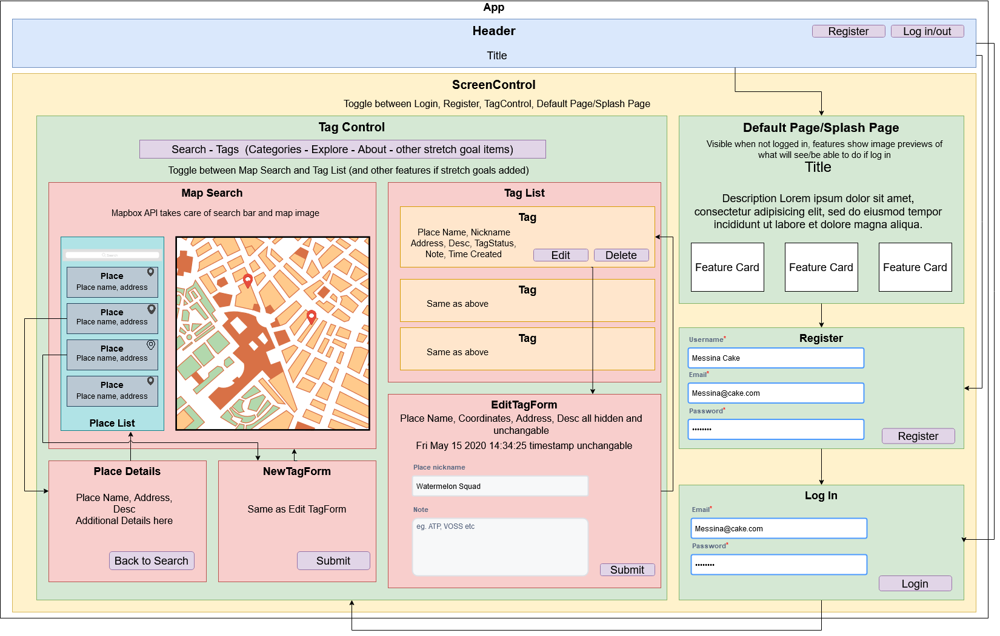
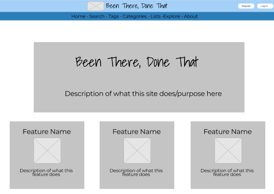
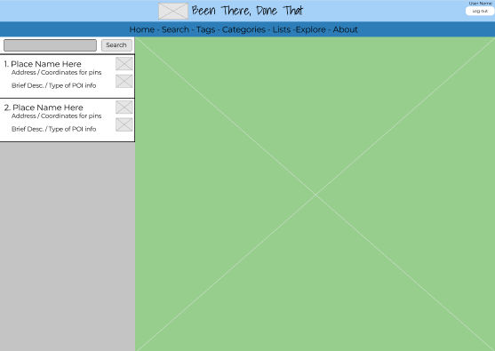
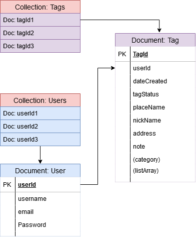
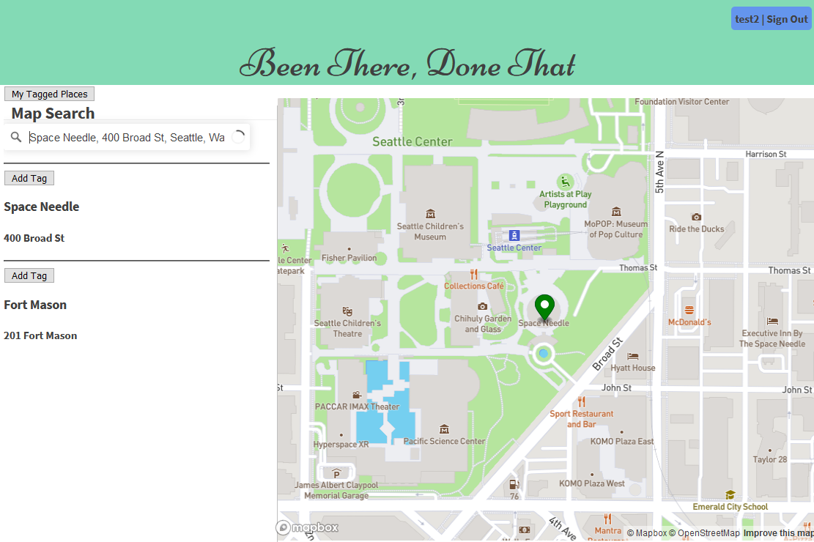
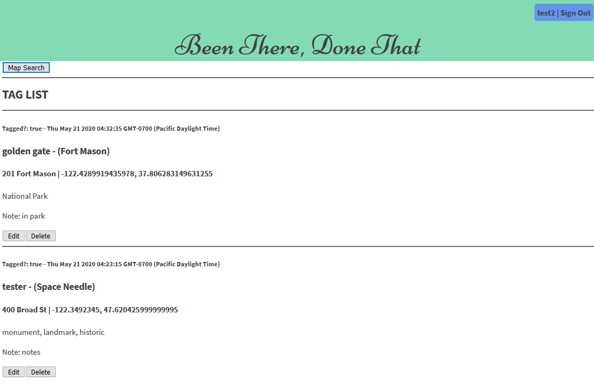
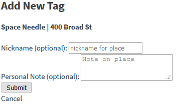
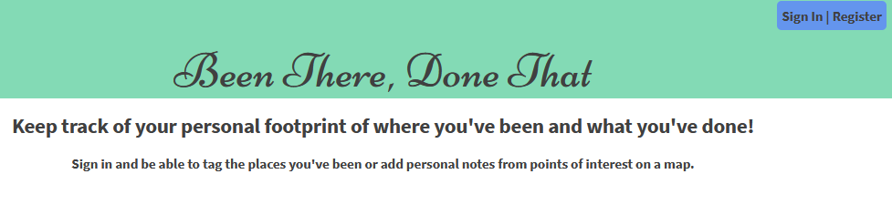

<h1 align="center">
  <a href="https://github.com/TSiu88/been-there-done-that">Been There, Done That</a>
</h1>

<h4 align="center"><em>Track your personal footprint of places you've been, Initialized 05.08.2020</em>
</h4>
<h4 align="center"><em>By: Tiffany Siu</em></h4>

<!--  -->
<!--  -->

  
  
  
  
  
  

---
## Table of Contents
1. [About the Project](#file_folderabout-the-project)
    - [Description](#bookdescription)
    - [Notable Features](#sparklesnotable-features)
    - [Known Bugs](#microbeknown-bugs)
2. [Setup/Installation Requirements](#wrenchsetup/installation-requirements)
    - [Requirements to Run](#toolboxrequirements-to-run)
    - [Instructions](#gearinstructions)
    - [Other Technologies Used](#desktop_computerother-technologies-used)
3. [Project Scope](#dartproject-scope)
    - [Use Cases](#writing_handuse-cases)
    - [Minimal Viable Product](#compassminimal-viable-product)
    - [Future Product Roadmap](#world_mapfuture-product-roadmap)
    - [Component Diagram/Wireframe](#classical_buildingcomponent-diagram/wireframe)
    - [Database Structure](#file_cabinetdatabase-structure)
    - [Specifications](#memospecifications)
    - [User Stories](#speech_balloonuser-stories)
4. [Screenshots](#framed_picturescreenshots)
5. [Testing](#test_tubetesting)
6. [Support and Contact Details](#mailboxsupport-and-contact-details)
7. [License](#balance_scalelicense)
---
## :file_folder:About the Project

### :book:Description

Been There, Done That is a web application that tracks your personal footprint of where you've been before by being able to tag if you've been somewhere and add private notes to a place of interest on a map.

The purpose of this project is to help people keep track of places they’ve been and things that they’ve seen.  Whether it’s as simple as the restaurants they tried in the area, to major landmarks from exotic trips, it would allow people to tag a place with when it occurred and leave a note for themselves as a reminder of whatever information they want to know about a place.

### :sparkles:Notable Features
This project is uses mapbox geocoding API, React front end, and Firebase back end.  This mix of technologies is not often used so there is much less documentation for using React with mapbox. It is expected to use multiple mapbox APIs (Geocoding and Tilequery) to display a map with custom markers and popups that can be added or removed from a personal list of tagged places in the future.

This project also uses a mix of technologies that I have not had a lot of experience in previously or are newly learned technologies that I haven't had as much practice in so I wanted to challenge myself with technologies I feel like I am not as strong in.

This project also faced many struggles.  There is less documentation on using React with mapbox than in other languages so it was difficult to figure out how to design components, what syntax to use for different functionalities, and less examples were available to reference. The documentation also was difficult to parse through for the different APIs and understanding what each API did was not very clear.  The design of the component structure was also more complex so it was more difficult to get the components to work together easily and both React and maps were difficult to combine since they both are trying to update the DOM.  However I will try to continue working on this project to find solutions or work around these issues.

### :microbe:Known Bugs

  - [ ] Search box only returns a single point that does not appear in the list of found places.  Places are currently hard-coded in for testing.
  - [ ] Search box response not as a valid geoJSON object
  - [ ] Search box does not prioritize currently visible map for search results
  - [ ] Toggling between Map Search and Tagged List does not re-render map to be visible
  - [ ] Map does not have custom markers highlighting points of interest or popups currently working
  - [ ] Tagged places does not have editing or remove functionality yet
  - [ ] Place details does not have button functionality to go back yet
  - [ ] Toggling between Map Search and Add Form toggles between Add Form and Tagged places instead
  - [ ] Authorization for only being able to view, edit, add, and delete tags privately not implemented yet
  - [ ] Map size not responsive vertically to window size

<!-- _There are currently no known bugs in this program_ -->

## :wrench:Setup/Installation Requirements

### :toolbox:Requirements to Run

* _Web Browser_
* _Webpack_
* _Node.js_
* _NPM_
* _Mapbox API KEY_

### :gear:Instructions

1. Download and install Node.js from the [official website](https://nodejs.org/en/download/)
2. Clone the [repository](https://github.com/TSiu88/been-there-done-that.git) from my [GitHub page](https://github.com/TSiu88)
3. Use a command line/Bash to move to the project directory with `cd insert-project-directory-name-here`
4. Sign up for an API key with [Mapbox](https://www.mapbox.com/) and save the API Key given in a `.env` file as `REACT_APP_MAPBOX_ACCESS_TOKEN = insert-access-token-api-key-here`
5. Run `npm install` to get all dependencies. 
6. Run `npm run start` to start up the program 
7. Open [http://localhost:3000](http://localhost:3000) to view it in the browser.

### :desktop_computer:Other Technologies Used

#### MVP
* _HTML_
* _CSS_
* _Javascript_
* _React_
* _Redux_
* _[Firestore](https://cloud.google.com/firestore)_
* _[Mapbox Geocoding API](https://docs.mapbox.com/api/search/#geocoding)_
* _Bootstrap 4.4.1_
* _ESLint_
* _Babel_
* _Jest_
* _Markdown_
* _Visual Studio Code_
* _[Trello](https://trello.com)_
* _[Draw.io](https://app.diagrams.net/)_
* _[Figma](https://www.figma.com)_

#### Planned with Future Product
* _Custom markers in mapbox_
* _Mapbox popups with info on map_
* _Mapbox Tilequery API for search results viewable on map_
* _Mapbox Tilesets API to upload a personal tileset layer to view tagged locations on a map_
* _Semantic UI for more fancy styling_
* _Share buttons to connect with social media_
* _Share a tagged place with note/snapshot using a paid SMS service_
* _D3.js for data visualization of density of tags/notes in states/counties_
* _Calendar integration showing dates tags/notes added_

## :dart:Project Scope

### :writing_hand:Use Cases
Users are anyone who would like help remembering where they’ve been from world travels to local businesses.

The product focuses on private notes as memory reminders and does not focus on reviews or sharing information as its main function, though it may be possible in the future.

The product would allow all places to be tagged from businesses to points of interest and personal dropped pins.

The product will only allow editing, deleting, and viewing tagged places from the person who owns it and only viewable if shared by the person.

### :compass:Minimal Viable Product

* This application will be a web application
* It will use a Geocoding API for place data (mapbox)
* Data will persist in a firebase database
* Have user authentication/authorization so users must log in to use this application
* Users will be able to tag a places as visited or add a private note about a place

### :world_map:Future Product Roadmap

* Be able to edit, delete, group, or otherwise alter existing tags
* Be able to group/categorize places tagged with premade or user made categories
* Be able to make personal lists of places separate of categories
* Be able to see places you’ve been before on the map as a pin
* Be able to sort/view places by proximity to current location/input location, by date, by category, etc.
* Have both public and private note options
* Have user authorization/authentication to only be able to view, edit, add, or delete tags/notes that they own
* Have admin authorization to be able to view all tags for all users
* Have a list of most popular sites or least possible sites tagged locally or in a searched location for recommendations
* Be able to create a phone app version which works with android and apple to be used mobily 
* Clicking on places pops up other information like address, phone, hours, pics, reviews, etc. as well as the button to check that you’ve been there
* Be able to deploy this site and/or mobile app
* Be able to share notes/places with other people through posting to other ways/ social media sites like facebook, texting, etc.
* After adding a place to your list of havebeens, can add snapshots (photo and limited text) to remember or share a memory of a place
* Data Visualization of overall areas places tagged in the app with D3.js, darker when more tags in the area
* Calendar integration to be able to view tags/notes by when they were added on a calendar
* Trip planner/trip maker to route between sites/tour between sites in a category/list

### :classical_building:Component Diagram/Wireframe

  
Click to expand to view Initial Wireframes/Prototypes

  Wireframe of Home Page When not Signed
  

  Wireframe of Search and map section
  

### :file_cabinet:Database Structure

### :memo:Specifications

  
Click to expand to view Specifications

| Specification | Input | Output |
| :-------------     | :------------- | :------------- |
| The program displays a splash screen with basic info and features if a user is not logged in and on the home page | Application start | Splash page and features displayed |
| The program has the ability to log in or register for an account and sign out once logged in | User uses authentication features | Log in/out shown, able to view rest of application |
| The program has a map with search functionality for places | On Map Search view | Map with search functionality and list of places for search results displayed |
| The program has a list of tagged places added that has buttons to edit or delete existing tags | Navigate to Tagged Places List | Places previously tagged with info and buttons to edit or delete visible |
| Places can be selected from the search result listing and added to the tagged places list | Place add form submitted | Place appears on the "My Tagged Places" list |

### :speech_balloon:User Stories

* As a user, I want to be able to keep track of where I've been and be able to edit my saved places so that I can easily alter my own data in the system and visualize where I've been.

* As a user, I want to be able to organize my tags/notes by categories, groups, location, and other criteria so that I can easily find the relevant information of if I've been somewhere or not.

* As a user, I want to be able to search for places of interest and select it from search results so that I can add the place to my saved tags.

* As a user, I want to be able to have my tags/notes kept private and only shared when I wish them to so that I can keep my information private and not need to write a comprehensive review on a place.

* As a user, I want to have this application become available for mobile platforms so that I can use it on the go using a phone's GPS for location data.

## :framed_picture:Screenshots

_Here is a preview of what the map search screen looks like:_

_Here is a preview of what the tagged places looks like:_

  
Expand to view More Screenshots 

  _Here is a snippet of what adding a tag looks like:_

  

  _Here is a snippet of what the splash page looks like:_

  

## :test_tube:Testing
_Tests are done through Jest along with using ESLint and are run from the command line prompt with `npm test`.  Some were done initially but most removed with the refactoring to use Firebase._

## :mailbox:Support and contact details

_If there are any question or concerns please contact me at my [email](mailto:tsiu88@gmail.com). Thank you._

## :balance_scale:License

*This software is licensed under the MIT license*

Copyright (c) 2020 **_Tiffany Siu_** :octocat:
