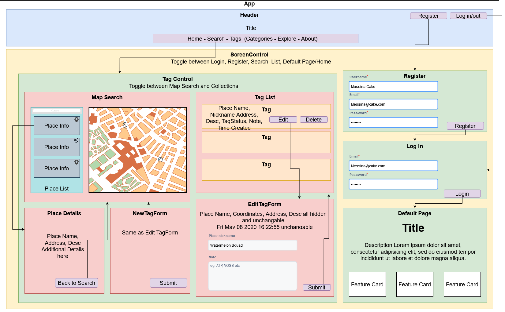

<h1 align="center">
  <a href="https://github.com/TSiu88/been-there-done-that">Been There, Done That</a>
</h1>
<h4 align="center"><em>Track your personal footprint of places you've been, Initialized 05.08.2020</em>
</h4>
<h4 align="center"><em>By: Tiffany Siu</em></h4>

<!--  -->
<!--  -->

  
  
  
  
  
  

---
## Table of Contents
1. [About the Project](#about-the-project)
    - [Description](#description)
    - [Notable Features](#notable-features)
    - [Known Bugs](#known-bugs)
2. [Setup/Installation Requirements](#setup/installation-requirements)
    - [Requirements to Run](#requirements-to-run)
    - [Instructions](#instructions)
    - [Other Technologies Used](#other-technologies-used)
3. [Scope](#scope)
    - [Use Cases](#use-cases)
    - [Minimal Viable Product](#minimal-viable-product)
    - [Future Product Roadmap](#future-product-roadmap)
    - [Specifications](#specifications)
    - [User Stories](#user-stories)
    - [Component Diagram/Wireframe](#component-diagram/wireframe)
    - [Database Structure](#database-structure)
4. [Screenshots](#screenshots)
5. [Testing](#testing)
6. [Support and Contact Details](#support-and-contact-details)
7. [License](#license)
---
## About the Project

### Description

Been There, Done That is a web application that tracks your personal footprint of where you've been before by being able to tag if you've been somewhere and add private notes to a place of interest on a map.

The purpose of this project is to help people keep track of places they’ve been and things that they’ve seen.  Whether it’s as simple as the restaurants they tried in the area, to major landmarks from exotic trips, it would allow people to tag a place with when it occurred and leave a note for themselves as a reminder of whatever information they want to know about a place.

### Notable Features
This project is expected to use mapbox API to display a map with custom markers and popups that can be added or removed from a personal list of tagged places.

### Known Bugs

_There are currently no known bugs in this program_

## Setup/Installation Requirements

### Requirements to Run

* _Web Browser_
* _Webpack_
* _Node.js_
* _NPM_
* _API KEY_

### Instructions

1. Download and install Node.js from the [official website](https://nodejs.org/en/download/)
2. Clone the [repository](https://github.com/TSiu88/been-there-done-that.git) from my [GitHub page](https://github.com/TSiu88)
3. Use a command line/Bash to move to the project directory with `cd project-directory-name-here`
4. Run `npm install` to get all dependencies. 
5. Run `npm run start` to start up the program 
6. Open [http://localhost:3000](http://localhost:3000) to view it in the browser.

### Other Technologies Used

#### MVP
* _HTML_
* _CSS_
* _Javascript_
* _React_
* _Redux_
* _Firestore_
* _Bootstrap 4.4.1_
* _ESLint_
* _Babel_
* _Jest_
* _Markdown_
* _Visual Studio Code_
* _Mapbox API_

#### Planned with Future Product
* _Custom markers in mapbox_
* _Material UI for more fancy styling_
* _Share buttons to connect with social media_
* _Share a tagged place with note/snapshot using a paid SMS service_
* _D3.js for data visualization_
* _Calendar integration_

## Scope

### Use Cases
Users are anyone who would like help remembering where they’ve been from world travels to local businesses.

The product focuses on private notes as memory reminders and does not focus on reviews or sharing information as its main function, though it may be possible in the future.

The product would allow all places to be tagged from businesses to points of interest and personal dropped pins.

The product will only allow editing, deleting, and viewing tagged places from the person who owns it and only viewable if shared by the person.

### Minimal Viable Product

* This application will be a web application
* It will use a Places of Interest API for place data (mapbox)
* Data will persist in a firebase database
* Have user authentication/authorization so users can log in and be only able to see their own data

### Future Product Roadmap

* Be able to group/categorize places tagged with premade or user made categories
* Be able to make personal lists of places separate of categories
* Be able to see places you’ve been before on the map as a pin
* Be able to sort/view places by proximity to current location/input location, by date, by category, etc.
* Have both public and private note options
* Have a list of most popular sites or least possible sites tagged locally or in a searched location for recommendations
* Be able to create a phone app version which works with android and apple to be used mobily 
* Clicking on places pops up other information like address, phone, hours, pics, reviews, etc. as well as the button to check that you’ve been there
* Be able to deploy this site and/or mobile app
* Be able to share notes/places with other people through posting to other ways/ social media sites like facebook, texting, etc.
* After adding a place to your list of havebeens, can add snapshots (photo and limited text) to remember or share a memory of a place
* Data Visualization of overall areas places tagged in the app with D3.js, darker when more tags in the area
* Calendar integration to be able to view tags/notes by when they were added on a calendar
* Trip planner/trip maker to route between sites/tour between sites in a category/list

### Component Diagram/Wireframe

  
Click to expand to view Initial Wireframes/Prototypes

  Wireframe of Home Page When not Signed
  

  Wireframe of Search and map section
  

### Database Structure

### Specifications

<!-- * _List of features the program should do, from simplest to more complex, handling all possible cases.  Can do as text or put in table, with example input and output -->

<!-- 

  
Click to expand to view Specifications

| Specification | Input | Output |
| :-------------     | :------------- | :------------- |
| The program displays welcome message and menu with prices | Application start | Welcome message and menu displayed |
| The program displays special deals in readable format | Application start | Special deals displayed ("Buy 2, get 1 free" "3 for $5") |
| The program takes input of user that is not an integer, then assume 0 ordered | Bread="aaa", Pastry="" | Bread=0, Pastry=0 |
| The program takes number of loaves of bread and pastries and displays totals | Bread=4, Pastry=4 | Bread=$20, Pastry=$8, Total=$28 |
| If input qualifies for special deals, costs calculated using discounted price | Bread=3, Pastry=3 | Bread=$10, Pastry=$5, Total=$15 |

 -->

### User Stories
<!-- 

  
Click to expand to view User Stories 
 -->

<!-- * As a scheduler, I want to be able to organize nurses vacation schedules without much paperwork so that I can be more efficient.
* As a scheduler, I want to see a list of requests with the overlapping dates and the nurses that sent in the requests organized by priority so I can see which staff member should have priority in getting the request approved. -->

<!-- * Give stories for people who will use this project and what they'd want it to do.  Can include customers/end users, programmers that maintain code, etc. Use "As a <job title/type of user/etc>, I want to...<what want program to achieve>... so that I can...<reason>.-->
<!-- 
 -->

## Screenshots

<!-- _Here is a snippet of what the input looks like:_

_Here is a preview of what the output looks like:_

 -->

<!-- 

  
Expand to view More Screenshots 

  

 -->

<!-- _{Show pictures using , show what library does as concisely as possible but don't need to explain how project solves problem from `code`_ -->

## Testing
_Tests are done through Jest along with using ESLint and are run from the command line prompt with `npm test`._

<!-- _Some example tests:_

 -->

<!-- _describe and show how to run tests with `code` examples}_ -->

## Support and contact details

_If there are any question or concerns please contact me at my [email](mailto:tsiu88@gmail.com). Thank you._

## License

*This software is licensed under the MIT license*

Copyright (c) 2020 **_Tiffany Siu_**
